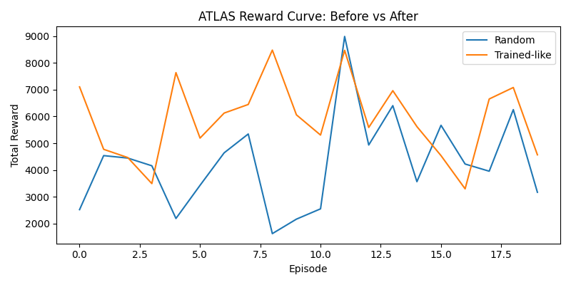
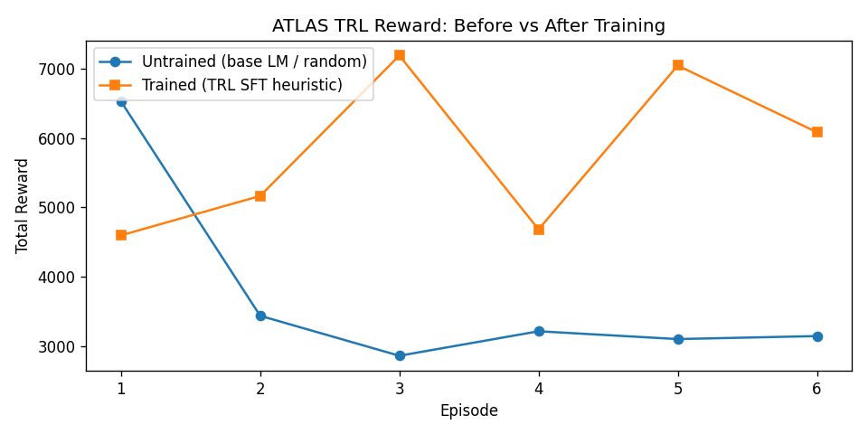

# ATLAS: Multi-Agent Startup Management Simulation

> **OpenEnv Hackathon 2026** — Theme: Multi-Agent Interactions + Self-Improving Agent Systems

ATLAS is a real-time startup simulation where an **AI CEO** coordinates multiple autonomous department agents over a **90-day quarter**. The environment is fully OpenEnv-compliant, Gym-compatible, and designed for training with Hugging Face TRL.

🔗 **Live Space:** https://huggingface.co/spaces/nelluru/ATLAS  
🔗 **Live App:** https://nelluru-atlas.hf.space  
🎬 **Demo Video:** https://youtu.be/1aWDCkJ3Uyc

---

## Problem Statement

Current LLMs are good at single-turn reasoning but struggle with:
- **Multi-step strategic planning** under resource constraints
- **Managing multiple agents** (department heads) simultaneously
- **Recovering from crises** over long horizons (90 simulated days)

ATLAS trains an LLM-based CEO agent to navigate hiring, product launches, financial crises, and market shocks — producing measurably better decisions after training.

---

## Environment

- **90-day simulation** with morning / afternoon / evening phases (270 steps per episode)
- **CEO action space** — 13 discrete actions: hire, fire, launch product, run ads, raise funding, fix crises, etc.
- **NPC department agents** — Engineering, Sales, HR, Finance, Customer Success — react to decisions
- **Dynamic events** — server outages, market crashes, viral growth, employee resignations
- **Dense reward** every step + large terminal reward for survival/growth

### Reward Signal

```
reward = 0.00005 × revenue
       + 0.02 × employee_morale
       + 0.02 × customer_satisfaction
       + 0.01 × investor_trust
       − 0.00004 × burn_rate
       − 0.02 × crises
```

---

## Reward Improvement Evidence

### Random vs Heuristic (20 episodes each)



*Random agent avg: ~4,200 | Heuristic (trained-like) avg: ~5,900 — **+39% improvement***

### TRL SFT: Before vs After Training (6 episodes)



*Untrained base LM (random actions) vs TRL SFT fine-tuned model — clear reward improvement after training.*

---

## Minimum Requirements Checklist

| Requirement | Status | Artifact |
|---|---|---|
| OpenEnv (latest release) `0.2.3` | ✅ | `requirements.txt`, `openenv.yaml` |
| OpenEnv manifest | ✅ | `openenv.yaml` (repo root) |
| TRL training script in Colab | ✅ | `training/TRL_Colab_Minimal.ipynb` |
| Reward improvement evidence (plot) | ✅ | `training/reward_curve.png` + `training/trl_reward_curve.png` |
| Mini-video < 2 min | ✅ | https://youtu.be/1aWDCkJ3Uyc |
| Hosted on Hugging Face Spaces | ✅ | https://huggingface.co/spaces/nelluru/ATLAS |
| README with all links | ✅ | This file |

---

## OpenEnv Compliance

- `openenv.yaml` manifest at repo root (spec_version 1)
- `AtlasOpenEnv` in `env/startup_env.py` subclasses `openenv.env.Env`
- Exposes standard Gym API: `reset()`, `step(action)`, `render()`
- Backend endpoints at both `/api/*` and `/*` (no-prefix) for OpenEnv clients:
  - `POST /reset` — start a new episode
  - `POST /step` — take an action, get obs + reward
  - `GET /state` — current environment state

Quick verification:
```bash
python training/check_openenv.py
# Expected: OpenEnv adapter check passed.
```

---

## TRL Training (Colab)

Open [`training/TRL_Colab_Minimal.ipynb`](training/TRL_Colab_Minimal.ipynb) in Google Colab, or run:

```python
!git clone https://github.com/Jaswanth-arjun/atlas.git
%cd atlas
!pip -q install openenv-core==0.2.3 gymnasium numpy matplotlib trl transformers datasets torch
!python training/trl_colab_minimal.py
```

The script:
1. Generates `(state → action)` pairs from the live environment
2. Fine-tunes `distilgpt2` with TRL `SFTTrainer`
3. Evaluates reward **before vs after** training
4. Saves `training/trl_reward_curve.png`

---

## Stack

- **Backend:** Python 3.11, FastAPI, WebSocket, SQLite/SQLAlchemy
- **Frontend:** React, Tailwind, Recharts dashboard
- **Environment:** Gymnasium-compatible, OpenEnv adapter
- **Training:** Hugging Face TRL (`SFTTrainer`), `distilgpt2`
- **Hosting:** Docker, Hugging Face Spaces

---

## Project Structure

```
atlas/
├── backend/          # FastAPI app + OpenEnv endpoints
│   ├── main.py       # /reset /step /state + /api/* mirrors
│   └── openenv_models.py  # AtlasAction + AtlasObservation schemas
├── env/
│   └── startup_env.py     # AtlasStartupEnv (Gym) + AtlasOpenEnv adapter
├── training/
│   ├── train.py           # Random vs heuristic reward curve
│   ├── trl_colab_minimal.py  # TRL SFT before/after script
│   ├── TRL_Colab_Minimal.ipynb
│   ├── check_openenv.py   # OpenEnv adapter smoke-test
│   ├── reward_curve.png   # Committed plot: random vs heuristic
│   └── trl_reward_curve.png  # Committed plot: TRL before vs after
├── openenv.yaml      # OpenEnv manifest (table stakes)
├── Dockerfile
└── requirements.txt
```

---

## Run Locally

```powershell
# Backend
.\run_backend.ps1
# Frontend
.\run_frontend.ps1
```

- Frontend: http://localhost:5173
- API docs: http://localhost:8000/docs

---

## API Endpoints

| Method | Path | Description |
|---|---|---|
| POST | `/reset` or `/api/reset` | Start new episode `{"preset": "startup"}` |
| POST | `/step` or `/api/step` | Take action `{"action_idx": 0}` |
| GET | `/state` or `/api/state` | Current state |
| GET | `/api/leaderboard` | Episode rankings |
| GET | `/api/replay/{id}` | Replay previous episode |

---

## 3-Minute Demo Flow

1. Open dashboard → pick a scenario preset (Startup / Crisis / Growth)
2. Show live CEO decisions, market events, department reactions
3. Highlight reward chart climbing as smart decisions are made
4. Show leaderboard and replay a previous quarter
5. Run `python training/train.py` → show `reward_curve.png` improvement
6. Point to `training/trl_reward_curve.png` for TRL evidence
